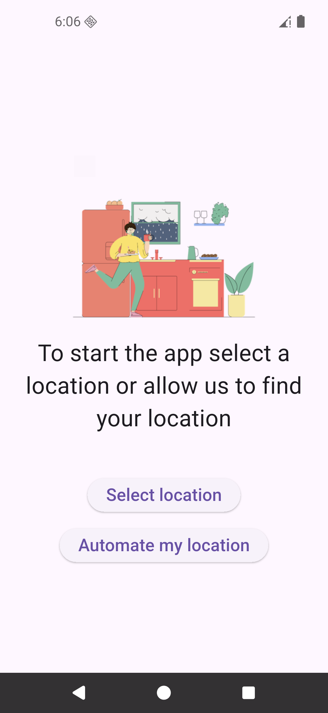

# Project Weather 🌦️

A modern, open-source weather app built with Flutter. Designed to explore state management, API operations, null-safety, exception handling, and more — while keeping a premium UI/UX experience in mind.

<p align="center">
  
  
</p>

## Getting Started

### Prerequisites

This project does not include a `.env` file. To run the app properly, you need an API key from OpenWeatherMap. You can either purchase a developer plan or verify as a student.

1. Create a `.env` file in the project root directory.
2. Add the following lines:

```env
API_KEY=[your api key from openweathermap.org]
OWM_BASE_URL=https://pro.openweathermap.org
NOM_BASE_URL=https://nominatim.openstreetmap.org
```

3. Install dependencies and run the app:

```bash
flutter pub get
flutter run
```

## Tech Stack

* **Flutter** (State Management: Riverpod / Provider)
* **Hive** (Local Storage & Caching)
* **OpenWeatherMap API**
* **Nominatim (OpenStreetMap)**
* **intl / ARB** (Localization & Multi-language support)

## Features

* Multi-language support (system locale detection)
* Local caching for instant weather display
* Background refresh for updated forecasts
* Dynamic theme & unit settings
* Smooth performance with async handling & frame-drop prevention

## How It Works

1. **On app launch:**
   * Registers adapters
   * Opens the **settings box** and initializes settings
   * If no language/unit is set, the system's default locale is applied

2. **In the splash screen:**
   * Opens all other Hive boxes (except settings, already opened)

3. **In the widget tree:**
   * App state is checked
   * If saved locations exist → navigates to **Weather Page**
     * Cached data (weather, hourly forecasts, etc.) is shown instantly
     * Background refresh updates the data
   * If no saved locations → navigates to **Intro Page**
     * User can select a location or allow location detection

## Why This Project Exists

This project was created as a learning journey:

* Understanding **state management**
* Practicing **API integration**
* Exploring **null-safety** and **exception handling**
* Building a **premium UI/UX** with Flutter
* And of course, not spending the entire summer just playing video games 😉

## 📸 Preview


<p align="center">
  
  
  
  
  
  
</p>

<p align="center">
  
  
  
  
  
  
</p>